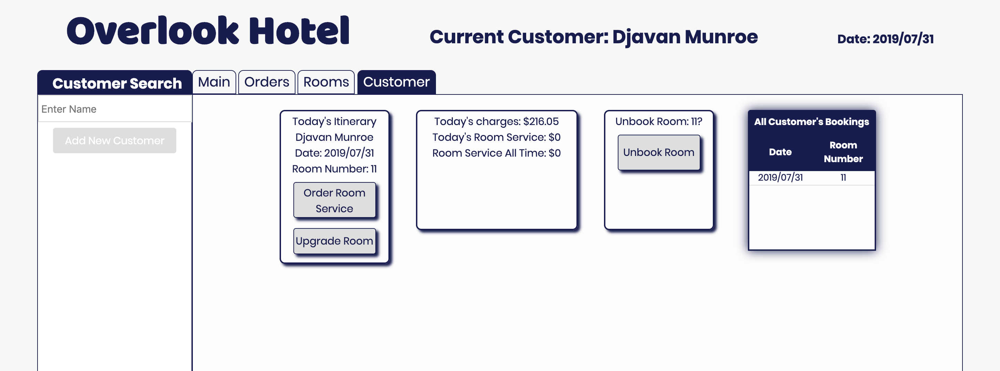

# Overlook Hotel App

Overlook was a one week project where I created a hotel management app that used the Fetch api to gather
customer data that would be managed through a dashboard. The user is able to create new hotel customers, book, unbook, and order room service. Data for the hotel revenue, bookings, reservations, and menu is then displayed on the page. 

The main objectives of this project were to properly implement ES6 classes, write dry, modular code that follows SRP, and create comprehensive tests utilizing mocha and chai/spies.

## Screens

## Author:
Djavan Munroe ([Djavanm](https://github.com/djavanm))

## Built With
- Javascript
- JQuery
- Webpack
- Mocha
- Chai
- HTML
- CSS

